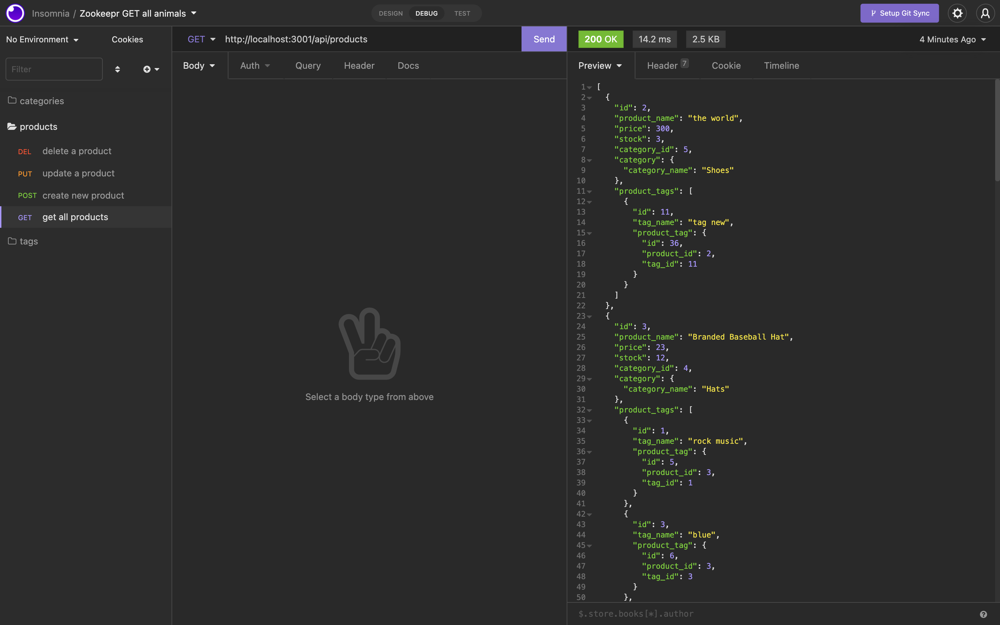
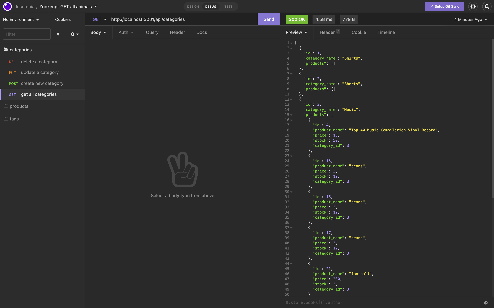
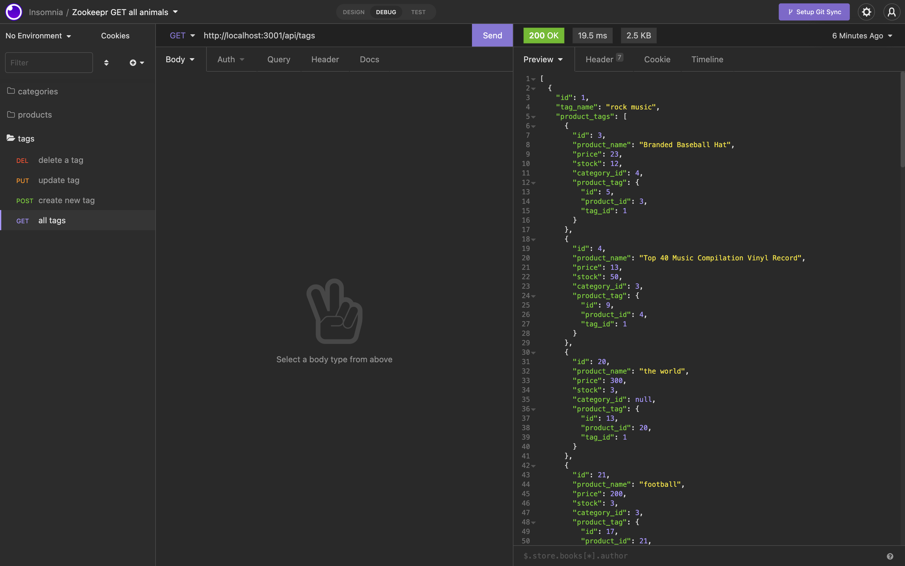

# e-commerce-trillionairs

## Purpose
Create a back-end e-commerce database that allows you to create, update, delete and show all data according to Categories, Products, and Tags.

## Description
AS A manager at an internet retail company
I WANT a back end for my e-commerce website that uses the latest technologies
SO THAT my company can compete with other e-commerce companies  
GIVEN a functional Express.js API
WHEN I add my database name, MySQL username, and MySQL password to an environment variable file
THEN I am able to connect to a database using Sequelize
WHEN I enter schema and seed commands
THEN a development database is created and is seeded with test data
WHEN I enter the command to invoke the application
THEN my server is started and the Sequelize models are synced to the MySQL database
WHEN I open API GET routes in Insomnia for categories, products, or tags
THEN the data for each of these routes is displayed in a formatted JSON
WHEN I test API POST, PUT, and DELETE routes in Insomnia
THEN I am able to successfully create, update, and delete data in my database

## Built With
* JAVASCRIPT
* MYSQL
* SEQUELIZE
* EXPRESS.JS

## Preview of page

# Website
https://github.com/EliP2389/e-commerce-trillionairs.git
* Video 1
https://watch.screencastify.com/v/aO7LrW80hY5CB1KpdugG
* Video 2
https://watch.screencastify.com/v/Rbc0wU1R5mkDcrZtgAVz
